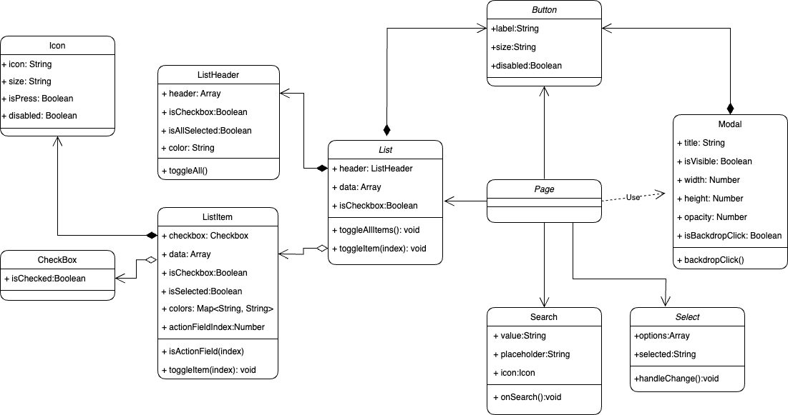

# 面試紀錄系統

這是一個面試紀錄系統，以「面試中的前端工程師角度」設計，用於記錄和管理面試的詳細信息。系統主要通過列表（List）展示每個面試的以下信息：

- **公司名稱**
- **面試職位**
- **狀態**
- **面試日期**
- **更新日期**

系統還提供兩種過濾和搜尋方法：**Select** 和 **Search**，以便更方便地查找和管理面試紀錄。

## 功能介紹

### 1. 列表展示（List）

- 列表顯示所有面試的詳細信息，每一項面試紀錄作為一個列表項目（ListItem）顯示在系統中。

### 2. 過濾和搜尋

- **Select**：通過下拉選單過濾特定條件的面試紀錄。
- **Search**：通過關鍵字搜尋面試紀錄。

### 3. 批量選擇與刪除

- 列表項目旁邊有復選框（CheckBox），用戶可以勾選單個或多個列表項目進行批量操作。
- 列表頭（ListHeader）的復選框可以勾選或取消選擇所有列表項目的復選框。

## UML 圖

以下是系統的 UML 圖，展示了各個組件之間的關係。



## 安裝與使用

1. **clone 專案**：

   ```bash
   git clone https://github.com/your-username/interview-todo-list.git
   cd interview-todo-list
   ```

2. **安裝依賴**：

   ```bash
   npm install
   ```

3. **運行開發伺服器**：

   ```bash
   npm run dev
   ```

4. **瀏覽器進入網頁**：
   **[http://localhost:5173/](http://localhost:5173/)**
